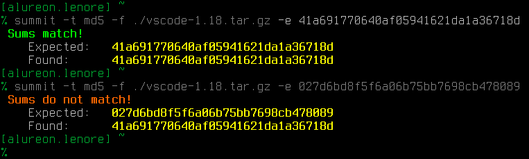
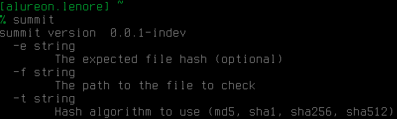

# summit
summit is a command line checksum validator.

Ever try and validate file integrity checksums before by just looking at them?  Yeah...that seems foolproof.  Well, now you don't have to anymore.  You can do it in an automated fashion!

## usage

The help menu should be sufficient enough, but you will generally use 3 arguments.

* `-t` this is the type of hash to use to validate your checksum. can be md5, sha1, sha256, or sha512.
* `-f` this is the path to the file you want to verify.
* `-e` (optional) this is the *correct* checksum you are hoping that your file has, if all went well.

## examples
* `summit -t md5 -f ./archlinux.iso -e d0ae8c4b4a037238e5f0880243d4619e`
* `summit -t sha1 -f ~/.bashrc`

Note: The `-e` flag is optional.  You can just get the hash of a file without specifying it.

## installation
#### the Go way
`go get github.com/proxa/summit`

#### just the executable
* Note: This was compiled on 64-bit Linux. I'm not entirely sure if Go execuatables can be dropped on different operating systems or architectures.
https://alureon.net/summit
