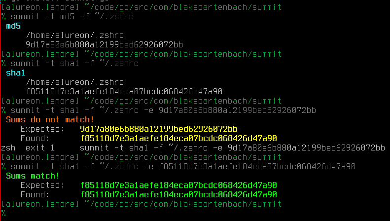

# summit

summit is a command line checksum validator.

Ever try and validate file integrity checksums before by just looking at them?  Yeah...that seems foolproof.  Well, now you don't have to anymore.  You can do it in an automated fashion!

`summit -t md5 -f ./archlinux.iso -e d0ae8c4b4a037238e5f0880243d4619e`

### Note
This is still very much a work in progress.  Do not expect a finished product yet.
